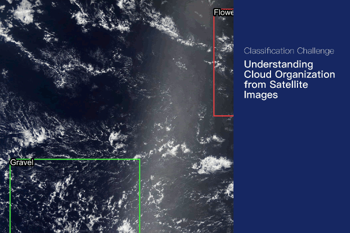

# Cloud segmentation project

### Matej Cief, Tomas Mizera

*Final assignment*

---

GitHub repo: [https://github.com/tomasMizera/nsiete-project](https://github.com/tomasMizera/nsiete-project)

**Content in this document**
1. Motivation
2. Dataset Description
3. Technical Documentation of NN
4. Training Routine
5. Conclusion & Related Work
6. Literature

---

#### 1. Motivation

In this project we are segmenting cloud satellite pictures and recognizing different types of clouds in them. There are 4 major cloud types - Fish, Gravel, Sugar and Flower[2]. The goal of this project is to automatize process of cloud types detection since it can help scientists to build greater environmental models that helps to predict future climate changes.

[1] mentions that:
 *There are many ways in which clouds can organize, but the boundaries between different forms of organization are murky. This makes it challenging to build traditional rule-based algorithms to separate cloud features.* 
Therefore there is a movement trying to classify clouds via Neural Networks.

#### 2. Datasets

Our dataset consists of train and test images downloaded from [Nasa Worldview](https://worldview.earthdata.nasa.gov/). Data was labeled by a team of of 68 scientists. There are 4 label names: Fish, Flower, Gravel, Sugar. And result value is 4 image masks, one for occurrence of each type of cloud. In total we have 5546 images in train dataset and 3698 images in test dataset.

Here is a visualized example from labeled train data:

Dataset is further analysed in `data_analysis` jupyter notebook.

#### 3. Technical Documentation

In this section we describe used NN architecture and describe some challenges we were facing while working on project.

##### 3.1 Overview

We used 2 neural network architectures with several backbones:
1. EfficientNet [4]
2. Unet

We use Unet for predicting masks based on input images (data analysis can be found in `analysis/data_analysis.ipynb`) with backbone `resnet` that extracts features and passes it to Unet.

##### 3.2 Unet

##### 3.3 Challenges & Solutions

While working on project we came across several challenges:

* run-length encoding (as described in analysis), labeled data provided from kaggle  and had to somehow transfer this encoding to mask image. We found several functions that transforms this encoding to images and used them.
* data streaming to model preventing memory overflow. Generator class was introduced - it also transforms data (e.g. run-length encoding to image and so on.)
* we also spent nice amount of time searching for possibilities to predict mask, not only category of clouds (not 4 output neurons, but entire convolutional layer) 

##### 3.4 Submitted Files

* `analysis/data_analysis.ipynb(.html)` - data analysis, also generated to html for simpler view 

* `main.py` - model definition and training

* `data/generator.py` - code for Generator class handling data manipulation and streaming to model

* `models/util.py`  - does dice coef

#### 4. Training Routine
Our training routine consists of following steps:
* Split data to train and test samples and create respective generators
* Download pretrained model backbone
* Compose own model (either `Unet` or `EfficientNet`)
* Fit model, provide train and validation generator, use callbacks to stop training if plateau

##### 4.1 What did we do?
* We started by implementing generator ([inspired by this notebook](https://www.kaggle.com/shahules/understanding-clounds-with-keras-unet)), which transforms image labels from `train.csv` to stream of images, produces input of dim (32, 256, 384, 3) - 32 is batch size
* Afterwards we split data to train and test and implemented our first model, `Unet` with backbone `resnet34`
* We have achieved around 55% accuracy (we used dice coefficient to measure that)
* Then to further improve our model, we tried to implement PR AUC callback ([source](https://www.kaggle.com/mobassir/keras-efficientnetb2-for-classifying-cloud))
* To do so, we had to remake our generator to provide image labels (y_true), so at the end of each epoch, PR AUC callback calls predict function over train dataset and computes AUC for precision and recall. If this recall stagnates for 5 epochs, it stops to train our model
* With PR AUC callback, we implemented EfficientNet, this time we were able to achieve only 21% accuracy and our model plateaued right at the beginning
* Then we tried to use other backbones, we again tried `Unet` with `densenet169`, but it ate all our RAM (32GB). After unsuccessful attempt with `densenet169`, we tried `inception`. This time we were able to achieve better results, than with `resnet34`. As I write this document, it ran 8 epochs and is 2 percentage points ahead
* We used `Adam` and `RAdam` as our optimizers everywhere

##### 4.2 First Complete Run

Our first big run was with Unet architecture and `resnet34` had 50 epochs and these were the results:

Legenda: <em>Validation data</em>  - <em>Train data</em>

*Model accuracy on 50 epochs*

*Model loss on 50 epochs*

We can see that current run stagnates at 20-25 epochs and after that loss function starts to arise.  It would make sense to stop training after this amount of epochs - this feature will be implemented in final submission.

##### 4.3 Training Results

Hereby we show results for later trainings

|No.| Acc | Epochs | Model |
|---|---|---|---|
|1|0.5|50|Unet|

#### 5. Conclusion

We were able to train NN model for a different cloud types partitioning. Outcoming model gives us mask for each cloud type on every picture we provide, final mask than needs to be rounded. While training data we found out that the Unet architecture gives us the best results out of all the models we tried.

##### 5.1 Related Work

Original idea comes from this [Kaggle competition](https://www.kaggle.com/c/understanding_cloud_organization/overview/description)[1] from *Max Planck Institute for Meteorology*. Competition's goal is to recognize different cloud types on provided test data. There are also included example `jupyter notebooks` with data loading and processing that can helped us get started. 

Further (in proposal) we provided a list of related works that would help us getting started or gain additional information in the weather area:

* Scientific paper *Combining crowd-sourcing and deep learning to understand meso-scale organization of shallow convection*[2],
* Thesis written by Adam Rafajdus[3] that tries to predict weather based on multiple weather factors, including cloud movements.

However, after several discussions we sticked with kaggle competitions and attached jupyter notebooks since we did not predict weather, but simply cloud types.

#### Literature

[1] [Understanding cloud organization, Kaggle competition by Max Planck Institute for Meteorology](https://www.kaggle.com/c/understanding_cloud_organization/overview)

[2] [*Combining crowd-sourcing and deep learning to understand meso-scale organization of shallow convection*, Rasp Stephan et al., 2019](https://arxiv.org/pdf/1906.01906.pdf)

[3] Weather Forecast by Generative Adversarial Networks, Adam Rafajdus, 2018, Thesis at Faculty of Informatics and Information Technologies STU.

[4] EfficientNet: Rethinking Model Scaling for Convolutional Neural Networks; *Mingxing Tan*, *Quoc Le*; Available at: [http://proceedings.mlr.press/v97/tan19a/tan19a.pdf](http://proceedings.mlr.press/v97/tan19a/tan19a.pdf)